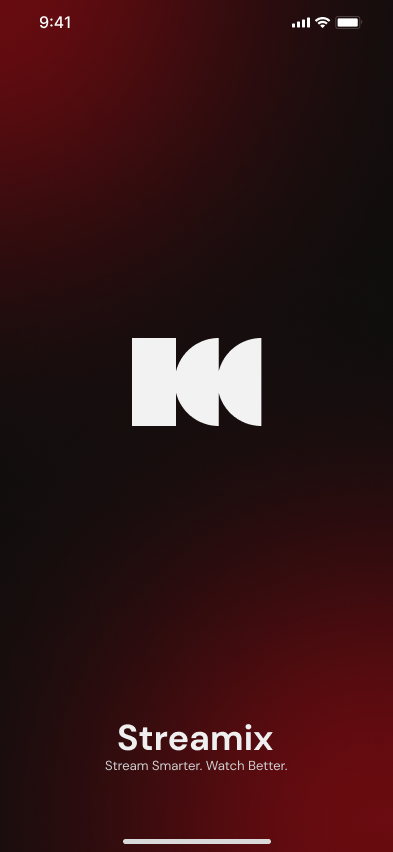
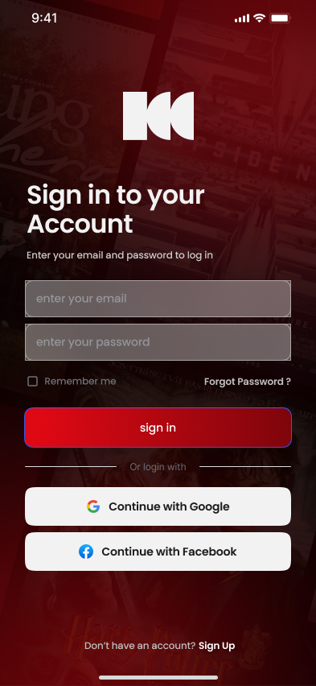
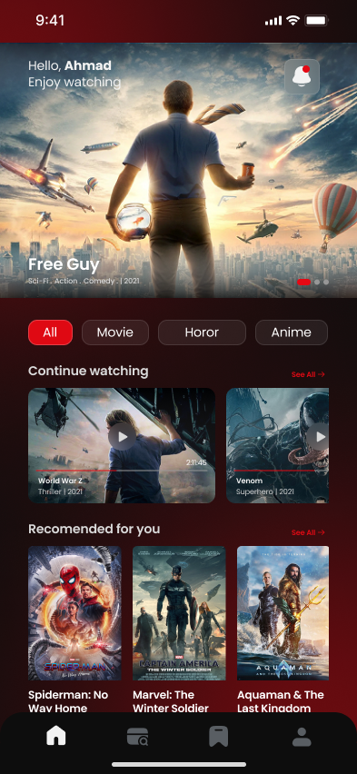

# devcycle_ui-ux_Streamix
# Latihan UI/UX Desainer - DevCycle

<table>
  <tr>
    <td style="vertical-align: top; padding-right: 20px;">
      Hai 👋  
      Saya <b>ahmad Riyadi</b>, selaku peserta yang mengikuti pembelajaran<b>DevCycle</b>.   
      Pada kesempatan ini, saya ingin memperlihatkan hasil latihan desain dari kegiatan 
      <b>DevCycle UI/UX Designer</b>.
    </td>
    <td>
      
    </td>
  </tr>
</table>

---

## 🎨 Tentang Desain

Desain ini merupakan latihan pembuatan *tampilan aplikasi mobile* dengan fokus pada penerapan *UI/UX dasar*.  
Beberapa elemen yang dilatih dalam desain ini antara lain:

1. *Tampilan Awal (Splash Screen)*  
   - Menampilkan logo Streamix.  
   - Judul aplikasi: Streamix dengan deskripsi singkat "aplikasi ini adalah aplikasi untuk menonton film".  
   - Menggunakan *warna hitam dan merah* sebagai identitas visual utama.
   - ## 📱 Preview Desain
     

2. *Halaman Login*  
   - Menyediakan input form (Email & Password).  
   - Terdapat tombol Masuk serta opsi login menggunakan Google.  
   - Fitur tambahan seperti Lupa Password dan Daftar akun baru juga ditampilkan.
   -  ## 📱 Preview Desain
     
  
3. *Horizontal Scroll & Vertical Scroll*  
   - Latihan membuat komponen card yang dapat digeser secara horizontal maupun vertikal.
   - Membiasakan penggunaan layout scroll agar konten lebih mudah diakses oleh pengguna.
   - ## 📱 Preview Desain
     

## ✨ Catatan

Latihan ini dibuat sebagai bagian dari kegiatan *DevCycle* untuk mengasah kemampuan dalam *UI/UX Design*, khususnya dalam membangun tampilan aplikasi yang ramah pengguna serta konsisten dalam gaya visual.

